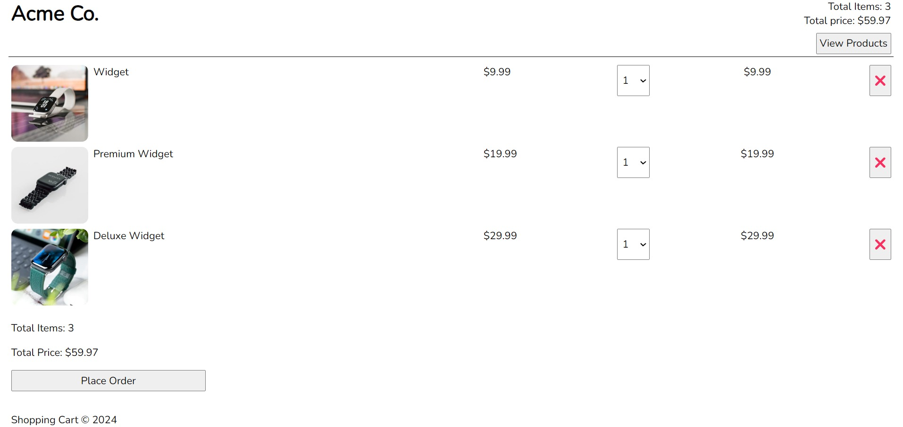

<u>TypeScript</u>
===

## Papar Information
- Title:  `Eienne KOA`
- Authors:  `Eienne KOA`

## TypeScript est JavaScript avec syntaxe pour les types.

TypeScript est un langage de programmation fortement typé qui s'appuie sur JavaScript, vous donnant un meilleur outillage à n'importe quelle échelle.

# ⚙ Outils de développement Web gratuits

[🔗Vite](https://vitejs.dev/)

[🔗 Navigateur Web Google Chrome](https://tailwindcss.com/docs/guides/vite)

[🔗 Visual Studio Code (alias VS Code)](https://www.google.com/chrome)

[🔗 Extension de code VS serveur en direct](https://code.visualstudio.com/)

## Projets 

 

